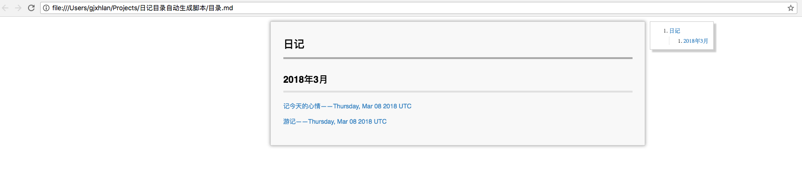

# Introduction

我个人比较喜欢写日记，日记文件直接存在笔记本的一个文件夹中。日记多了，浏览以前写过的日记会比较麻烦，所以写了这个脚本。

这个脚本可以收集当前目录下的所有 markdown 文件并生成一个目录文件，按时间降序排列，并按月份进行分组。

基于 python3 编写。

# Run the script

运行 generate.command 文件即可。

# Output sample

生成 目录.md，在浏览器中打开即可。

